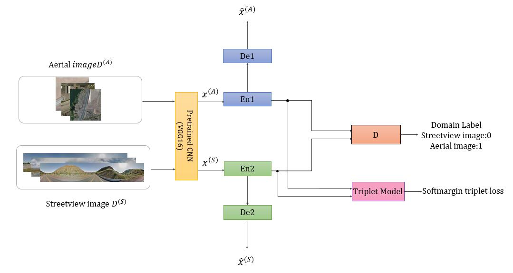

## Network Architecture


## Requirements
- Python
- NumPy
- [Tensorflow](https://github.com/tensorflow/tensorflow)>=1.4
- keras>=1.3

## Experiment Dataset

- CVUSA datset: a dataset in America, with pairs of ground-level images and satellite images. All ground-level images are panoramic images.  
	The dataset can be accessed from https://github.com/viibridges/crossnet

## Usage
**Step 1.** Download this repository with ``git`` or click the button.

**Step 2.** Use ``input_data.py`` to extract the VGG features of the image, and all the features of the training set and test set will be saved in the ``data`` file.
```
$ python input_data.py
```

**Step 3.** Use the ``data_processing.py`` file to separate the VGG features under the ``data`` folder and save them to the ``data_vgg`` folder.

```
$ data_processing.py
```

**Step 4.** Training network and computing accuracy on test set.

```
$ python trian.py 
```

> **Note:** The default parameters of batch size is 100, and epoch 100. You may need to modify the ``train.py`` file 

## Results
After each iteration, the accuracy of the model is calculated. Precision data is stored in ``accuracy.txt`` under ``model (automatic generation)`` folder.
